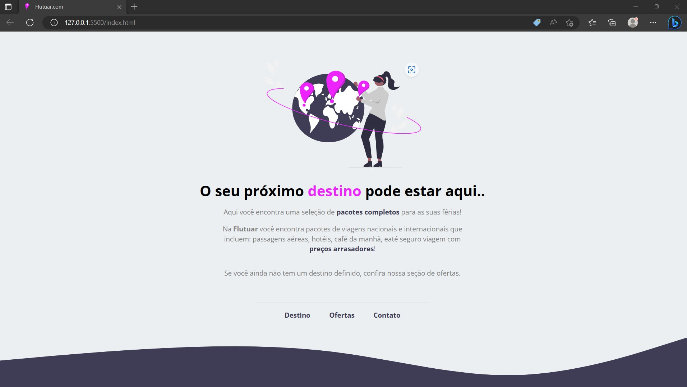

<h1 align="center">Flutuar.com</h1>

 O Explorer é um programa completo que reúne tudo o que você precisa para iniciar no mundo da programação Web, te auxiliando a desenvolver suas habilidades técnicas e comportamentais, para que você alcance sua primeira vaga no mercado de programação. 

  <a href="#-tecnologias">Tecnologias</a>&nbsp;&nbsp;&nbsp;|&nbsp;&nbsp;&nbsp;
  <a href="#-projeto">Projeto</a>&nbsp;&nbsp;&nbsp;|&nbsp;&nbsp;&nbsp;
  <a href="#-layout">Layout</a>&nbsp;&nbsp;&nbsp;|&nbsp;&nbsp;&nbsp;
  <a href="#memo-licença">Licença</a>

  

 

  

 

## 🚀 Tecnologias

Esse projeto foi desenvolvido com as seguintes tecnologias:

- HTML e CSS
- Figma

 
## 💻 Projeto

Recriar uma langing page de uma aplicação chamada "Flutuar.com", baseado no layout disponibilizado no Figma. Neste projeto foi possível exercitar, meus conhecimentos em posicionamento de elemetos, espaçamento e trabalhar ainda mais com tags semântica. 

- [Visite o projeto]()

 
## 🔖 Layout

O layout do projeto encontra-se no Figma e você pode ter acesso através [DESSE LINK](https://www.figma.com/file/b9llrruSgst2YxLtWw2erm/Projeto01-Extra-(Copy)?node-id=1-2&t=cKZ0gd4CBcrZlctj-0).

 
## 🔒 Layout

Esse projeto está sob a licença MIT.
